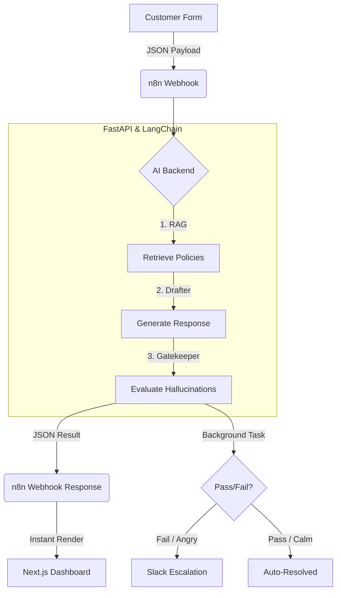

# Autonomous Support & Escalation Engine

## 1. Overview
An enterprise-grade, multi-layered customer service automation system. It intercepts customer support tickets, uses an intelligent agent to draft context-aware responses based on internal policies, and programmatically evaluates those drafts for hallucinations and tone. Safe responses are sent automatically; risky responses are escalated to human agents via Slack.

## 2. System Workflow

The architecture is highly decoupled, ensuring immediate UI feedback while maintaining robust, asynchronous backend validation.



*   **1. Frontend Trigger:** A user submits a ticket via the Next.js UI, which proxies the request directly to the n8n orchestrator.
*   **2. AI Processing:** n8n securely routes the payload to the FastAPI backend, where an AI Agent retrieves company policies, drafts a personalized response, and evaluates customer sentiment.
*   **3. Safety Evaluation:** A secondary Gatekeeper LLM acts as an auditor, scoring the draft for hallucinations and strict policy compliance.
*   **4. Instant UI Render:** The backend returns the evaluation to n8n, which instantly responds to the frontend webhook. The UI updates natively without freezing.
*   **5. Background Escalation:** n8n silently continues in the background. If the AI draft failed safety checks or the customer is angry, it escalates the ticket directly to human agents via a Slack alert.

## 3. Tech Stack
*   **Orchestration:** [n8n](https://n8n.io/) (Handles webhook ingestion, conditional routing, and API communication)
*   **AI Framework:** [LangChain](https://www.langchain.com/) (Manages the Agent logic, tool calling, and RAG pipeline)
*   **Support Agent (Drafter):** Groq `openai/gpt-oss-20b` (Provides extreme speed and high daily request limits for basic logic and drafting)
*   **Evaluator (Gatekeeper):** Groq `openai/gpt-oss-20b` via [DeepEval](https://confident-ai.com/) (Provides complex reasoning as a strict LLM-as-a-judge for QA, keeping costs at $0.00)
*   **Vector Database (Embeddings):** Google `text-embedding-004` (Fast, free semantic search replacing OpenAI embeddings)
*   **Frontend Showcase:** Next.js (Interactive Split-Screen Demo UI)
*   **Human-in-the-Loop (HITL):** Slack / CRM (For manual review of escalated tickets)

## 4. System Architecture

1.  **Ingestion:** n8n listens for incoming emails or support tickets (e.g., Zendesk webhook).
2.  **Processing:** n8n sends the payload to a custom LangChain backend (Python/Next.js).
3.  **RAG & Drafting:** 
    *   LangChain Agent converts the query to a vector.
    *   Searches the Vector Database for relevant company policies.
    *   `openai/gpt-oss-20b` drafts a response and classifies user sentiment.
4.  **Evaluation:** DeepEval immediately scores the drafted response against the retrieved context to check for Hallucinations and Answer Relevancy.
5.  **Routing (The Switch):** The backend returns the draft and the DeepEval score to n8n.
    *   *Path A (Pass):* If Score >= 0.85 & Sentiment is safe -> n8n emails the customer automatically.
    *   *Path B (Fail/Escalate):* If Score < 0.85 or Sentiment is angry -> n8n posts the draft and original ticket to a Slack channel for human approval.

## 5. Interactive Split-Screen Demo
To showcase this complex backend orchestration, the project includes an interactive Next.js web application designed for recruiters and clients:

*   **Panel 1 (Customer View):** A mock ticket submission form acting as the trigger for the n8n webhook.
*   **Panel 2 (Admin/Under-the-Hood View):** A real-time terminal UI that visualizes the hidden agentic workflow:
    *   Visualizes the LangChain Agent searching the vector DB.
    *   Displays the Drafted Response.
    *   Features a **DeepEval Scorecard** that flashes pass/fail based on hallucination checks.
    *   Shows the final routing decision (Auto-Reply vs. Slack Escalation).

## 6. Key Value Propositions
*   **Risk Mitigation:** Incorporating DeepEval as a live gatekeeper solves the primary enterprise fear of AI hallucinations.
*   **Human-in-the-Loop:** Demonstrates maturity by not fully automating edge cases, relying on elegant escalation paths instead.
*   **Cost-Efficient AI Engineering:** Showcases advanced AI engineering by using a hybrid **Groq + Gemini API** architecture. We use Llama 3.1 8B (via Groq) for rapid drafting, Llama 3.3 70B for strict evaluation, and Gemini for embeddings, providing state-of-the-art reasoning at exactly $0.00 while avoiding serverless memory limits.
*   **Full-Stack Execution:** Merges highly technical backend AI orchestration with a beautiful, client-facing React frontend.

## 7. Project Structure

This project uses a [Turborepo](https://turbo.build/) monorepo to orchestrate the Next.js frontend, Python FastAPI backend, and n8n Docker container concurrently.

```text
autonomous-support_escalation-engine/
├── apps/
│   ├── frontend/             # Next.js Application (Interactive Demo)
│   ├── backend/              # Python FastAPI (LangChain & DeepEval logic)
│   └── n8n/                  # Orchestration (Docker compose & workflows)
├── packages/                 # Shared configurations
├── turbo.json                # Turborepo pipeline configuration
└── package.json              # Root workspace definition
```
